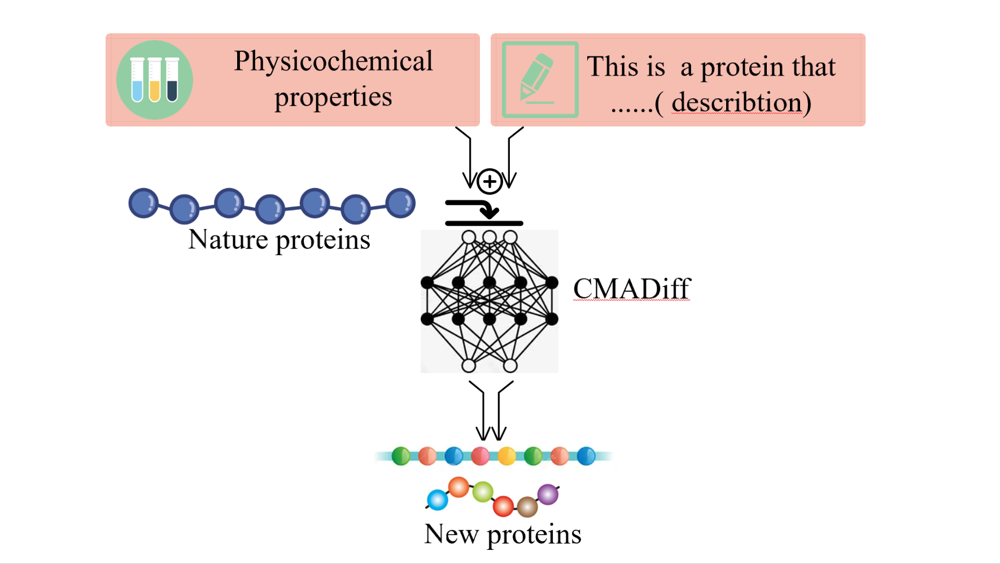
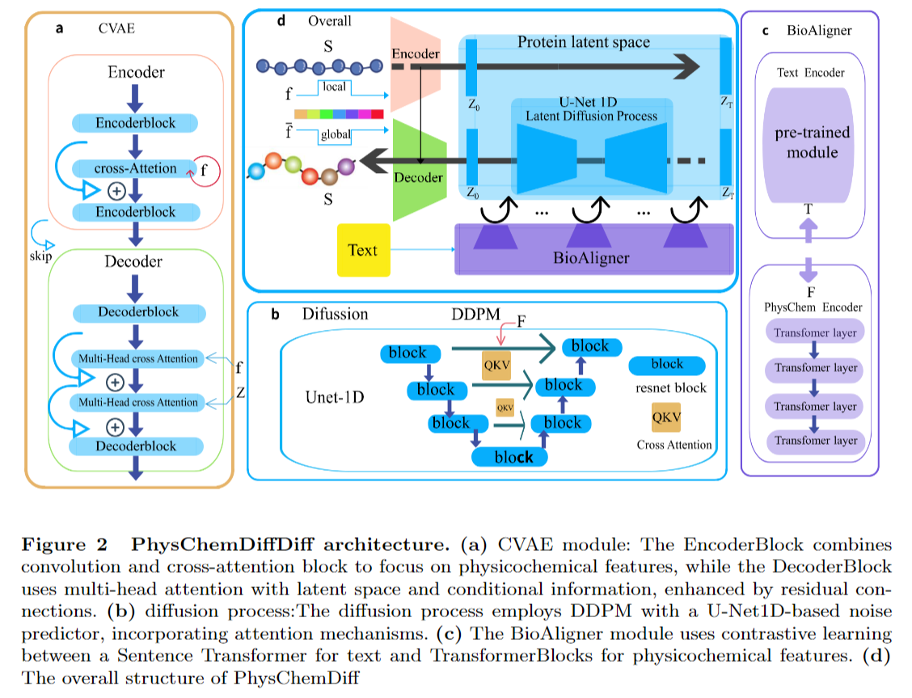

# PhysChemDiff: Physicochemical Property-Guided Protein Generation Using Latent Diffusion Models

This repository is the official implementation of [PhysChemDiff: Physicochemical Property-Guided Protein Generation Using Latent Diffusion Models](https://huggingface.co/sanyier312/PhysChemDiff/tree/main).



*Note:* The training code and protein sequences will be released after the paper is accepted.



---

## Requirements

To install the required dependencies, use the following command:

```bash
pip install -r requirements.txt
```

---

## Data Preparation

We provide relevant datasets with protein sequence length of 128 .

1. `swiss_onehot_and_feature_128.pt`: Contains the one-hot encoded protein sequences and the corresponding physicochemical properties of the protein sequences.
2. `swiss_text_128.csv`: Contains the protein sequences along with their textual descriptions.

You can download these datasets from the [Hugging Face Model Page](https://huggingface.co/sanyier312/PhysChemDiff/tree/main).And then place them in the `data` folder of this repository.

---

## Pre-trained Models

The pre-trained models for each module of the PhysChemDiff model can be downloaded from the [Hugging Face Model Page](https://huggingface.co/sanyier312/PhysChemDiff/tree/main) and you can place them in the `pretrained_models` folder of this repository.

---

## Inference

The instructions for running inference are available in the `inference.py` file. You can run the following command to perform inference:

```bash
python inference.py --use_dataset_for_features <True|False> --use_dataset_for_text <True|False> --num_samples <number> --seq_length <length> --custom_text <text> --num_timesteps <number>
```

---

### Notes:

- Ensure you have the correct environment setup as described in the requirements section.
- Refer to the `inference.py` file for additional arguments and detailed usage.

---
